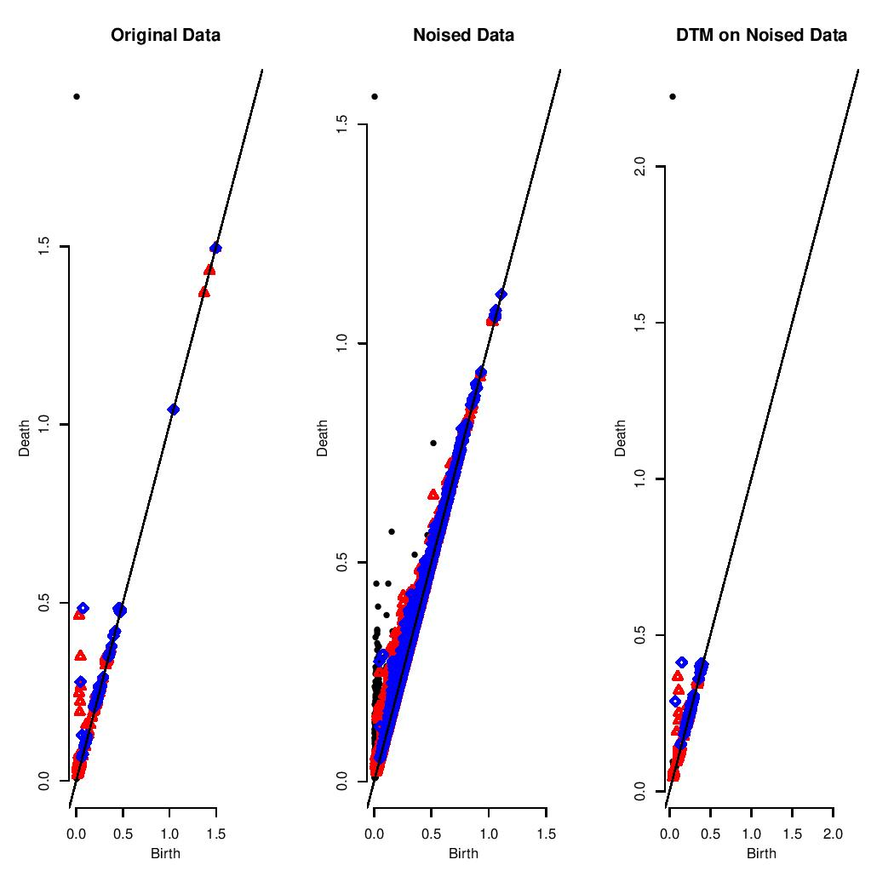

# Robust Topological Inference
Summary of a paper in TDA which proposes robust way to compute distance to point cloud called DTM.

## Using DTM

### Shape Reconstruction

Ground truth:


With outliers:


Smoothing with DTM:


### Persistent Homology

Ground truth:


With noise:


DTM was designed to compute persistent homology in the presence of noise/ouliers.

Persistent homology of the shapes:



## How to reproduce
Run ```./build_run_d.sh``` to build & run the docker (named ```dtm```).
All the figures are created from scripts in ```./scripts```.

### Scripts

* ```functions.R``` - all the functions used to create the figures and manipulate the data

* ```breaking_dtm.R``` - testing the robustness of dtm

* ```mnist.R``` - numbers classification on MNIST

* ```maxN_example.R``` - example of max persistence function

* ```outlier_example.R``` - small example on outliers

* ```pointClean.R``` - reconstruct yoda, or any other pointCleanNet point cloud

* ```sphere_pd.R``` - persistence diagram of a shpere

* ```summary.R``` - figures for the summary pdf

* ```folder.sh``` - copy a folder from running docker

* ```gif.sh``` - copy a gif from funnig docker

## Folders

* ```pdfs``` - extra material

* ```presentation``` - class presentation latex and figs

* ```scripts``` - R scripts

* ```summary``` - summary of the paper latex and figs


## Refrences

In [summary.pdf](summary/summary.pdf)
